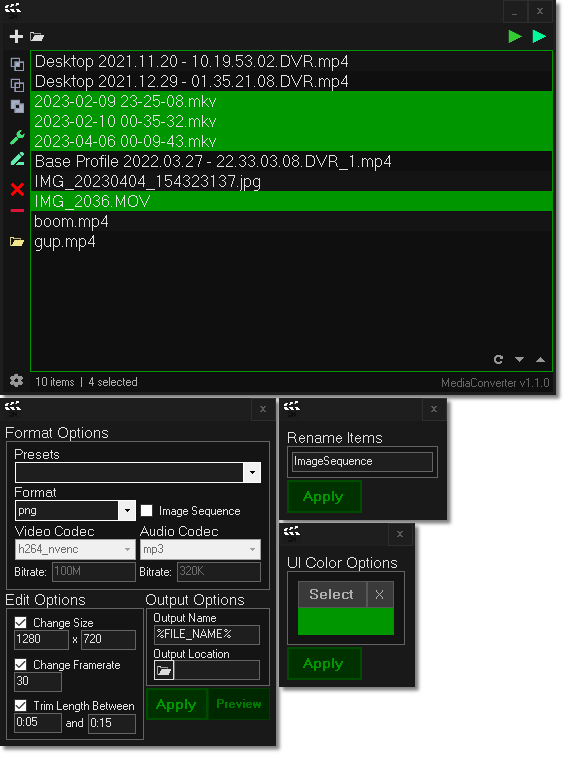

# [<b>>> Download Latest</b>](https://github.com/o7q/MediaConverter/releases/download/v1.0.1.0/MediaConverter.v1.0.1.0.zip)
### Welcome! MediaConverter is a simple, lightning-fast, GUI based tool that removes the hassle of using FFmpeg through a command-line.

### **NOTE:** This program is still very early in development! Many more features will be added. Stay tuned!

---

---

# Features
* Video, audio, and image processing
* Media editor including the ability to reformat, remux, resize, posturize time, trim, and more
* A fast and responsive UI
* Power-user friendly with built-in hotkeys
<!-- * Unrestricted access to FFmpeg's features -->

## Tips
* You can double click a queue item to edit it
* You can use your keyboard to quickly navigate the menus, hover over a control to see if it has a designated keyboard hotkey
* Even if a format or codec is not listed, you can access it by simply typing in its name

---

# Overview
MediaConverter takes in arguments and configures a batch script for FFmpeg. \
This program takes inspiration from Adobe Media Encoder. I was tired of the clunky and slow UI of Media Encoder so I made this much snappier version that has similar features alongside some of my own features.

### **Powered by**
FFmpeg: https://ffmpeg.org

---

## **Interface**

<b>Main Menu</b>

- **Mainbar**
    - **Add Media Button** Opens a file browser where you can select one or more media files to add to the queue
    - **Add Folder Button** Opens a folder browser where you can select a folder to import all media from
    - **Convert All Button** Converts all media in the queue
    - **Convert Selected Button** Converts only the selected media in the queue
- **Sidebar**
    - **Selection Buttons**
        - **Select All Button** Selects all media in the queue
        - **Deselect All Button** Deselects all media in the queue
        - **Invert Selection Button** Inverts the selection
    - **Editor Buttons**
        - **Edit Button** Opens the media editor with the selected media
        - **Rename Button** Opens the media renamer with the selected media
    - **Open Media Location Button** Opens the selected media's location in Windows Explorer (limited to 10 selections)
    - **Settings Button** Opens the settings window
- **Queue Box**
    - **Refresh Button** Refreshes the queue and resets the order, this is useful if your config is corrupted
    - **Move Buttons**
        - **Move Up Button** Moves the selected queue items up
        - **Move Down Button** Moves the selected queue items up
        - Note: You can use your up and down arrow keys as well.

<b>Media Editor Menu</b>

- **Format Options**
    - **Output Format Preset Dropdown** Pre-defined presets for common codec and format combinations
    - **Output Format Dropdown** File format for the output
    - **Image Sequence Checkbox** Choose if the output should be an image sequence or not
    - **Codec Options**
        - **Video Codec Dropdown** Video codec for the output
        - **Audio Codec Dropdown** Audio codec for the output
    - **Bitrate Options**
        - **Video Bitrate Textbox** Video bitrate for the output
        - **Audio Bitrate Textbox** Audio bitrate for the output
- **Edit Options**
    - **Resize Video Checkbox** Choose to resize the video output
        - **Video Width Textbox** Width for the video output
        - **Video Height Textbox** Height for the video output
    - **Change Framerate Checkbox** Choose to change the framerate for the video output
        - **Framerate Textbox** Framerate for the video output
    - **Use Timeframe Checkbox** Trim the length of the output between two points
        - **Start Textbox** Start time for the trim
        - **End Textbox** End time for the trim
- **Output Options**
    - **Output Name Textbox** Name for the output file
    - **Output Directory Button** Opens a folder browser to choose the output location
    - **Output Directory Textbox** The currently select output directory
- **Save Button** Saves the changes to the selected media files
- **Preview Button** Previews the current settings with the current media

<b>Options Menu</b>

- **UI Color Options**
    - **Select Button** Opens the color picker
    - **Reset Button** Resets the color to default
- **Apply Button** Applies option changes

---

**MediaConverter** \
Written in C# with .NET Framework 4.8